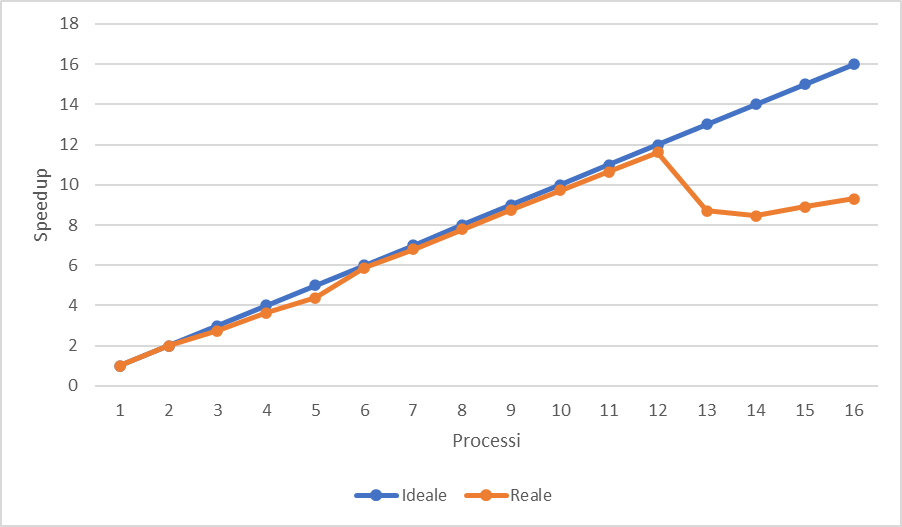
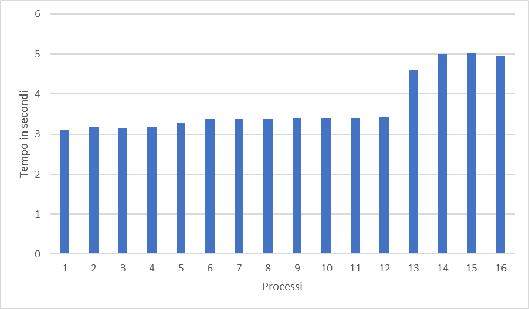

# 1. Introduzione

Il **forest fire model** è un modello utilizzato per simulare la diffusione degli incendi in ambienti naturali come le foreste. Il modello viene rappresentato attraverso una griglia bidimensionale di celle, dove ogni cella può avere uno dei seguenti 3 stati: albero, albero che sta bruciando o vuoto. All'inizio per ogni albero viene assegnata una probabilità con cui questo può prendere fuoco, da questi ultimi verrà propagato l'incendio.
L'incendio si propaga seguendo alcune regole: se l'albero è adiacente ad un albero che sta bruciando questo prenderà fuoco. Per adiacente abbiamo diverse interpretazioni, nel caso considerato in questo progetto vengono considerate adiacenti le celle strettamente vicine alla cella analizzata ovvero non vengono considerate le celle diagonali, l'immagine seguente indica in rosso le celle adiacenti alla cella blu:


# 2. Soluzione

Uno dei primi problemi considerati riguarda la suddivisione della foresta per ogni processo, la suddivisione è avvenuta considerando le righe della foresta, la prima scelta fatta considera che ogni processo deve avere almeno una riga, quindi deve verificarsi che *N≥size* dove N è il numero di righe e size è il numero di processi, se questa condizione non è soddisfatta il programma si interrompe.
Per la suddivisione possiamo considerare il seguente codice:

```c
if(rest > rank)
	rows = (N/size) +1;
else 
	rows = N/size;
```

Per avere una suddivisione equa tra i processi i primi processi con rank minore del resto tra il numero di righe e il numero di processi hanno *(numero di righe/numero di processi)+1* righe, mentre i processi restanti hanno *numero di righe/numero di processi* righe.
Tutte le operazioni fatte sulla foresta avvengono in modo parallelo anche le fasi di inizializzazione e stampa, quindi ogni processo effettuerà le tutte le operazioni sulla propria porzione di foresta.
La parte più importante dell'esecuzione del programma consiste nell'estensione dell'incendio, il problema da risolvere consiste nell'estensione del fuoco tra i vari processi, in particolare ogni processo deve conoscere le righe precedenti e successive dei processi vicini, in modo tale da comprendere se avviene la propagazione del fuoco nella prima e ultima riga della parte di foresta analizzata da ogni processo. 
Per fare ciò ogni processo deve comunicare le proprie righe estreme ai propri vicini, in questa fase possiamo individuare 3 casi: 

- il primo processo che dovrà inviare l'ultima riga della sua parte di foresta con il secondo processo;
- l'ultimo processo che dovrà inviare la prima riga della sua parte di foresta con il processo precedente;
- i processi intermedi che devono condividere la prima riga con il processo precedente e l'ultima riga con il processo successivo.

L'invio avviene in modo asincrono in modo tale da permette ai processi di continuare la propria esecuzione analizzando l'estensione del fuoco per tutta la parte di foresta del proprio processo. La ricezione avviene in modo sincrono, una volta ricevute le righe avviene il controllo per le righe estreme di ogni processo.

Ha una rilevanza importante anche il controllo che determina se l'incendio è terminato, infatti per terminare la parte di foresta di ogni processo non deve avere alberi che sono in fiamme, quindi abbiamo bisogno di un modo per coordinare tutti i processi nella decisione, questo coordinamento è stato fatto attraverso un processo master, in questo caso il processo con rank 0, ogni processo verifica se nella sua foresta ci sono ancora alberi in fiamme e invia il proprio risultato al nodo master, questo processo avviene attraverso la funzione di *gathering*, il nodo master dopo aver ricevuto tutti i risultati dei vari processi, li analizza e decide se l'incendio è terminato o meno, successivamente invia il proprio risultato a tutti gli altri processi attraverso la funzione di *broadcast* in modo tale che tutti i processi sono sincronizzati con questa decisione.

# 3. Dettagli di implementazione

La rappresentazione della foresta avviene attraverso una matrice di interi dove: 0 indica che l'elemento è vuoto, 1 indica che c'è un albero e 2 indica che c'è un albero che sta bruciando.

Ogni processo analizza e processa la sua parte di foresta attraverso l'uso del puntatore ***forest* l'inizializzazione avviene attraverso la funzione *initForest* questa assegna con una probabilità P se quell'elemento ha un albero o è vuoto.

- La funzione *igniteTrees* scorre tutta la foresta ed ad ogni occorrenza di un albero decide con probabilità F se questo sta bruciando o meno.
- La funzione *isFinished* controlla se in tutta la foresta non ci sono alberi che stanno bruciando in caso affermativo torna il valore booleano true, false altrimenti.
- La funzione *printForest* stampa a video la foresta, il valore count indica il numero di iterazione.
- La funzione *fireExtension* propaga il fuoco, per distinguere in modo corretto la scorsa iterazione con la corrente viene istanziata una nuova foresta chiamata *newForest* che alla fine dell'esecuzione di tutta la funzione conterrà il risultato corrente della foresta.
All'inizio della sua esecuzione viene fatto un controllo per verificare se la funzione è eseguita da un solo processo.
Per la comunicazione delle righe tra i vari processi sono stati individuati 3 casi:
    1. Primo processo invia l'ultima riga al processo *rank+1* e riceve la prima riga di quest'ultimo;
    2. Ultimo processo invia la prima riga al processo *rank-1* e riceve l'ultima riga di quest'ultimo;
    3. Processi intermedi inviano la prima riga al processo *rank-1* e inviano l'ultima riga al processo *rank+1*, ricevono l'ultima riga del processo *rank-1* e la prima riga del processo *rank+1*.
    
    Dopo aver ricevuto le righe i processi fanno il controllo su quest'ultime.
    
- La funzione *checkIntermediateRows* fa il controllo su tutta la parte di foresta per ogni processo, in particolare viene diviso in 2 casi nel caso in cui la foresta ha una sola riga e nel caso in cui la foresta ha più righe, per quest'ultimo sono stati individuati alcuni casi particolari in cui sono stati suddivisi i controlli, questi sono stati riportati graficamente nella seguente immagine:
    
    
    

# 4. Istruzioni per l’esecuzione

Per funzionare il programma ha bisogno che il numero di processi deve essere inferiore al numero di righe della foresta.
È possibile cambiare la dimensione della foresta, i parametri sono definiti dalle macro N ed M dove N indica il numero di righe, mentre M il numero di colonne, entrambi i parametri devono essere maggiori o uguali a 1, mentre il numero di colonne massimo è di 1010 elementi.

È possibile cambiare anche i parametri P e F che rappresentano le probabilità di creazione di albero e di innesco di incendio entrambi hanno un range di valori compresi da 0 a 100.

Per poter lanciare la verifica della correttezza bisogna aver creato una directory chiamata *correctness*, la verifica può essere lanciata quando il programma è eseguito da una sola macchina, in quanto su macchine diverse il processo che farà la verifica non avrà a disposizione tutti i file per poter ricostruire la matrice.
Per poter lanciare la verifica bisogna rimuovere i commenti alle linee: *16, 39-45, 81,86,103-105*.

# 5. Correttezza

Per verificare la correttezza della soluzione proposta ho deciso di confrontare l'esecuzione dell'algoritmo parallelo con l'esecuzione dell'algoritmo in sequenziale. La verifica avviene confrontando passo per passo l'algoritmo e ad ogni passo vengono confrontati tutti gli elementi della foresta se un solo elemento non corrisponde l'algoritmo non funziona correttamente. Il test è stato eseguito variando il numero di processi e la dimensione della foresta.
Le funzioni: *isFinishedSequential, fireExtentionSequential* sono state implementate per eseguire la foresta in modo sequenziale, in modo tale da poter verificare la correttezza.
Per l'implementazione per ogni processo ho eseguito la stampa della sua parte di foresta su un file chiamato “correctness*<NumeroProcesso>*.txt” per ogni iterazione dell'algoritmo, ogni processo ha un puntatore di tipo FILE chiamato *file* usato per fare la scrittura e creazione del file. La scrittura del file avviene attraverso la funzione *printForestFile*.
La verifica della correttezza avviene con la funzione *correctness* che può essere chiamata solo da un processo, questa funzione apre tutti i file scritti da tutti i processi e ricostruisce la matrice di partenza questa viene eseguita attraverso la funzione *fireExtentionSequential* ed ad ogni passo viene ricostruita la matrice eseguita in parallelo attraverso la funzione *extractFromFile *****dopo attraverso la funzione *isEqual* vengono confrontate le due matrici, se nel confronto troviamo una differenza di un elemento l'esecuzione viene interrotta e viene stampato un messaggio di errore.

# 6. Brenchmarks

I seguenti brenchmark sono stati eseguiti attraverso un cluster di 4 macchine su **Google Cloud Platform**, le macchine usate sono le *e2-standard-8* ogni macchina è composta da  8 vCPU e 32 GB di memoria, durante il test ogni macchina ha eseguito un massimo 4 processi. 3 Macchine erano localizzate nella zona “us-central1-a”, mentre una macchina nella zona “us-west1-b”, la differenza di zona ha creato una piccola latenza durante la comunicazione che è possibile notare analizzando i grafici riportati dai test.

### 6.1 Scalabilità forte

Per valutare la scalabilità forte la grandezza della foresta ad ogni esecuzione è stata impostata a 100.000 righe per 1000 colonne per un totale di 100.000.000 celle da analizzare durante tutta l’esecuzione, a causa dell’implementazione dell’algoritmo di inizializzazione le foreste per tutti i test sono diverse.
I risultati sono riportati nella seguente tabella:

| Processi | Tempo in secondi | Speedup |
| --- | --- | --- |
| 1 | 32.959814  | 1 |
| 2 | 16,589273 | 1,986814853 |
| 3 | 12,028160 | 2,740220782 |
| 4 | 9,072216 | 3,633049963 |
| 5 | 7,521742 | 4,381938918 |
| 6 | 5,616954 | 5,867915956 |
| 7 | 4,855043 | 6,788779008 |
| 8 | 4,237377 | 7,778352976 |
| 9 | 3,762070 | 8,761084722 |
| 10 | 3,385385 | 9,73591305 |
| 11 | 3,095404 | 10,64798456 |
| 12 | 2,839553 | 11,60739525 |
| 13 | 3,787668 | 8,701875138 |
| 14 | 3,892577 | 8,46735055 |
| 15 | 3,700848 | 8,906016675 |
| 16 | 3,542230 | 9,30482041 |

Analizzando i risultati ottenuti notiamo che inizialmente abbiamo un notevole miglioramento tra l’esecuzione dell’algoritmo sequenziale e l’algoritmo eseguito da 2 processi con l’aumento del processi notiamo comunque un notevole miglioramento soprattutto tra i 2 e 8 processi, ma con l’aumento del numero di processi diminuisce gradualmente anche lo speedup ottenuto. 
Analizzando i risultati per 2 processi otteniamo uno speedup molto elevato pari di *1,986* aumentando il numero di processi notiamo che lo speedup decresce gradualmente, in particolare notiamo che dopo l’esecuzione con 13 processi il tempo di esecuzione aumenta e si abbassa notevolmente anche lo speedup ottenuto, la decrescita è dovuta dall’overhead introdotto per la gestione e la comunicazione tra i vari processi, mentre notiamo che l’ultima macchina risiede in una zona differente il che porta a un crollo notevole delle prestazioni.
Notiamo che nei risultati reali non abbiamo risultati costanti questo è dovuto al fatto che ogni esecuzione dei test la foresta è diversa, ciononostante il comportamento nel caso in cui l'esecuzione fosse avvenuta con la stessa foresta per tutti i test sarebbe comunque molto simile ai dati ottenuti da questo test.



### 6.2 Scalabilità debole

Per verificare la scalabilità debole del programma ho considerato di mantenere fissa la dimensione delle colonne e di aumentare gradualmente il numero di righe della foresta.
I risultati ottenuti sono i seguenti:

| Processi | righe X colonne | Tempo in secondi |
| --- | --- | --- |
| 1 | 10.000X1000 | 3,094967 |
| 2 | 20.000X1000 | 3,170006 |
| 3 | 30.000X1000 | 3,149526 |
| 4 | 40.000X1000 | 3,171662 |
| 5 | 50.000X1000 | 3,278445 |
| 6 | 60.000X1000 | 3,383604 |
| 7 | 70.000X1000 | 3,378557 |
| 8 | 80.000X1000 | 3,379112 |
| 9 | 90.000X1000 | 3,412440 |
| 10 | 100.000X1000 | 3,398906 |
| 11 | 110.000X1000 | 3,405099 |
| 12 | 120.000X1000 | 3,419797 |
| 13 | 130.000X1000 | 4,605532 |
| 14 | 140.000X1000 | 5,009245 |
| 15 | 150.000X1000 | 5,031150 |
| 16 | 160.000X1000 | 4,961237 |

Vedendo i risultati ottenuti notiamo come il programma al crescere della dimensione della foresta mantiene un tempo piuttosto costante, anche se con l’aumento dei processi il tempo cresce gradualmente.
Come mostrato dal grafico sottostante i risultati rispecchiano i risultati ottenuti dalla scalabilità forte, in particolare notiamo che la crescita è piuttosto contenuta per i primi 12 processi mentre successivamente notiamo un aumento più significativo dei tempi.



# 7. Conclusioni

Il forest fire model è un problema *imbarazzantemente parallelizzabile*, ciò ha permesso una efficace parallelizzazione di tutte le fasi del programma.
La suddivisione del problema tra i vari processi è avvenuta in modo piuttosto equo, dove il processo più lento ha un massimo di M elementi in più, dove M sono le colonne della foresta. Avendo un limite piuttosto ridotto del numero di colonne della foresta questo ha permesso una maggiore efficienza dell’esecuzione in termini prestazionali, in quanto la differenza con il processo più lento ha un limite superiore di massimo 1010 elementi, sicuramente con M molto più grande si ha una scalabilità più limitata, rispetto ai risultati ottenuti da questo test.
Analizzando i risultati ottenuti attraverso la scalabilità forte e debole notiamo ottimi risultati, soprattutto per i test fino all’esecuzione con 12 processi, la decrescita può essere influenzato da diversi fattori, il primo sicuramente può essere legato all’overhead introdotto per la gestione e la comunicazione tra i vari processi, il secondo fattore è la latenza introdotta per la comunicazione con un’altra macchina, inoltre una delle macchine risiede in una zona diversa rispetto alle altre, introducendo una latenza piuttosto evidente durante la comunicazione.